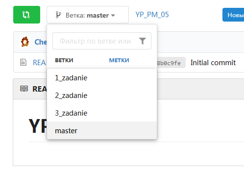

# Учебная практика ПМ.05 (36ч. + 36ч.)

## Проектирование пользовательских интерфейсов

---

- [1 TKinter Введение](1_TKinter_Введение.pdf)
- [2_TKinter_Button, label,Entry](<2_TKinter_Pack().pdf>)
- [3_TKinter_Pack()](<3_TKinter_Grid().pdf>)
- [4_TKinter_Text()](4_TKinter_Text.pdf)
- [5_TKinter_Radiobutton_Checkbutton](5_TKinter_Radiobutton_Checkbutton.pdf)
- [6_TKinter_Listbox](6_TKinter_Listbox.pdf)
- [7_TKinter_Bind](7_TKinter_Bind.pdf)
- [8_TKinter_event](8_TKinter_event.pdf)
- [9_TKinter_Canvas](9_TKinter_Canvas.pdf)
- [10_TKinter_Canvas_Animation](10_TKinter_Canvas_Animation.pdf)
- [11 TKinter Окна](11_TKinter_Окна.pdf)
- [12_TKinter_Grid](<12_TKinter_Grid().pdf>)
- [13_TKinter_messagebox](13_TKinter_messagebox.pdf)
- [14_TKinter_Menu](14_TKinter_Menu.pdf)
- [15_TKinter_Place](15_TKinter_Place.pdf)

---

## Задание

1.Читаем теорию под номером задания, потом выполняете самостоятельную работу написанную в конце

2.Регисnрируетесь, если ещё нету аккаунта на [gogs](http://192.168.124.42:3000/)

3.Выполняем программу

4.<ins>Для каждого задания, начиная с первого и заканчивая последним, создаём Отдельную Ветку в репозитории и выкладываем именно в неё!!! </ins>

имена веток именуем 1_zadanie, 2_zadanie и т.д

---

## Для тех кто не знал, не помнит, забыл или прохлопал ушами

[Замечательная статься](https://gist.github.com/rdnvndr/cb21a06c5a71fd71213aed1619380b8e)

---

# _Работа индвидуальная, чужая работа оцениваться не будет!!!_

Работа проверяется в конце практики

## Если не стоит python, [то](https://www.python.org/downloads/release/python-370/)
